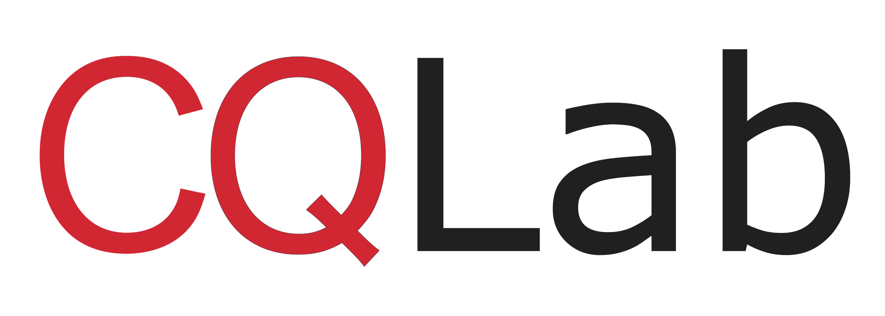

**Clinical Query Lab** (CQLab) is an open source framework for building clinical algorithms, decision trees, flow charts, clinical rules, and other logical representations of clinical knowledge.

The framework can be used to fully or partially automate clinical decision support recommendations, prior-authorization decisions, computable clinical guidelines, clinical calculations, and more. The execution and UI rendering engine can be embedded in custom applications, SMART on FHIR apps, CDS hooks, EHR integrations, and other projects as a Typescript module or microservice.

CQLab can be used to build JSON APIs, create stateful step by step workflows, distribute clinical rules and documentation, and automate tasks. Automation is supported by providing programmatic hooks that can leverage claims, EHR data, or other structured data (if it is available). AI/ML models can also be plugged in for evaluation to work with either structured or unstructured data.

Clinical algorithms commonly leverage the [FHIR](https://www.hl7.org/fhir/) data model, although other open or proprietary data models can be used as well. The SDK is modular and composable for flexibility, and allows abstract implementations to be plugged in to support custom requirements.

## Online Demos

## CQLab Modules

- CQFlow - Tools for creating and executing clinical algorithms, decision trees, flow charts, and rules.
- CQDefine - a programmatic SDK for documenting, managing, and evaluating logical rules against a database or FHIR server.
- CQVocabulary - A lightweight module for packaging ValueSets for efficient use by CQDefine.
- CQMockData - A collection of functions to create mock data that can be used to evaluate and test clinical rules and flow charts.

## CQLab Environments

CQLab consists of 2 primary environments - the **Editor Environment** and the **Execution Environment**.

- The **Editor Environment** is a no-code UI environment where flow-diagrams, decision trees, forms, and other clinical specifications can be designed and reviewed. Generally this environment is used by clinical domain experts without requiring code to be written.

- The **Execution Environment** is where an engineering team uses the specifications created in the editor environment as a template to generate libraries or services that can be deployed into a production software environment.

Building clinical software generally requires both clinical knowledge experts and software engineers to work together. We have found that two separate environments built specifically for the strengths of each team works best. Instead of forcing clinical teams to **learn to code** (which can take months or years) OR forcing programmers to attempt to **interpret clinical papers**, we have found separate tools that work seamlessly together allow for the most gains in productivity.

## Running the App on Localhost

The **Editor Environment** can be run locally as a browser based application.

First, clone this repo and ensure you have NodeJS installed. Then install the node dependencies:

```
npm install
```

Then build the application. There should not be any errors during build, if there are please contact our team ASAP.

```
npm run build
```

Finally, launch the server on localhost.

```
npm run launch
```

It should open at the following URL/Port on localhost, and the app logs should verify this is the correct url. Paste this URL into your browser.

```
http://localhost:4201
```

If this is your first time installing CQLab, we also suggest generating example data from CQExamples to get a feel for how different flow charts look, how they are launched in development, and how they can be configured and executed. To generate the data:

```
Navigate to the CQFlow application at: http://localhost:4200/flow
```

and then click `Generate Examples` at the top of the page.
